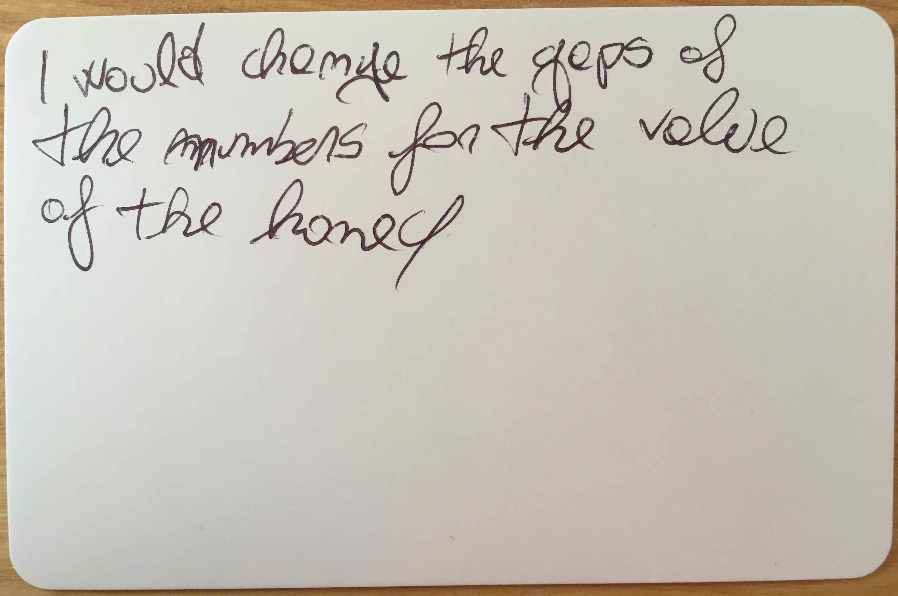
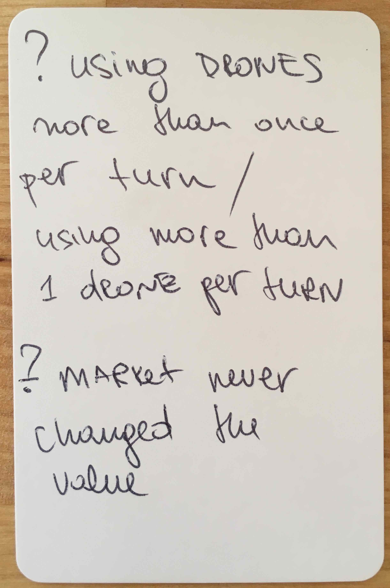

# The Hive v4.2 - 4p

Tested [v4.2](../versions/v4.2) with Davide, Sima, Tom and Fabiana at [The Hive](http://www.thehivewellbeing.com/).

[Listen to them playing and their feedback after](https://soundcloud.com/bpt20170602/davide-sima-tom-and-fabiana-v42-the-hive?in=beesness/sets/playtesting).

Tweaks / experiments:

* Players can *trade* two or more bees for another bee with the bank, eg trade a worker (6H) for 2 drones (3H + 3H), 2 workers (6H + 6H) for a queen (12H).
* Bees are limited: 6D, 12W and 6Q.
* Players start with 1W + 6H.
* Queen's cap is 12 honey.
* Referendum: each player gets a vote. If it's a tie, you count the number of bees (larger beesnesses win).

Final scores:

| | Fabiana | Davide | Sima | Tom | 
|--|--|--|--|--|
| Honey | 45 | 40 | 35 | 40 |

I'm not recording how many bees they ended with, as they've been trading them (more on that below).

## What went well

* **Limited bees** produce interesting game dynamics. First of all, players started to bid (aka **beed**) when two or more wanted to buy the same bee. 

* In the first half of the game Davide scooped up all the **drones** and kept them until the next-to-last round. This way, he `removed all the freelancers from the market` and prevented other players from attacking him.

* The game was **shorter** than in previous versions, with less time spent on individual turns and more on the flower + bees markets.

* People like the `freelance` and `full-time` taxonomy.

* People figured out that there's `too much gambling with the drones`. Davide felt the cards were balanced.

## Even better if

* Reference cards were useful, but people still had questions about the order of actions (also `sell` bees is no longer relevant).

* Referendum was never triggered, but at the very last round Fabiana could have ended the game by taking the *last* flower. She didn't though, as she was on the course to win the game. 

* Workers limited to 6? It felt that 12 were not necessary, but 6 could give them an edge.

* Tom suggested it'd be fun to have special bees (he's not the first one to bring this up).

* **Price chart** needs tweaking. Most rounds people were selling at 6H (4-7 flowers) with only one turn at 3 (8-11). People on average sell between 1 and 2  flowers, so there should be more splits between 4 and 8 (with 4P).

* People like the idea of **round-based events**, eg *this round everyone loses a worker*, or *this round the queen is striking*

## Actions

- [x] Keep experimenting with **trading** bees, eg trade a worker for 2 drones, 2 workers for a queen etc.
- [x] Keep experimenting with **bee scarcity**: 6D, 6W and 6Q (and solo-playtest these numbers for the 3P and 5P scenarios).
- [ ] **Referendum**: each player gets a vote. If it's a tie, you count the number of bees (larger beesnesses win).
- [ ] Reference cards: players can play their turn **actions in any order**.
- [ ] Reference cards: make it clear that players can **use all their cards** they have during their turn.
- [ ] Reference cards: remove reference to `selling` bees (it's trading). 
- [ ] **Timer**: 1 minute.
- [x] Honey limit (12) should be on the Queen card.
- [ ] **Market prices**: 12, 9, 6, 3, 0?
- [ ] **Calendar** with turn & market phases.
- [x] Encourage **trading and negotiating**.
- [ ] Solo-playtest: *Hive* card for savings. What about the Queen then?
- [ ] Solo-playtest: special bees (lazy, burn-out, defender, recruiter etc.)
- [ ] Solo-playtest: **round-based events**, eg *this round everyone loses a worker*, or *this round the queen is striking*