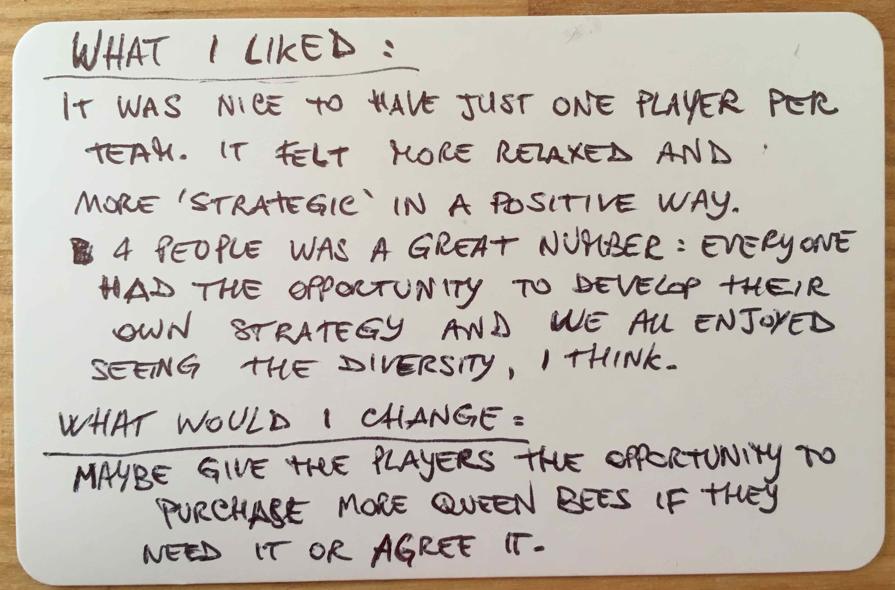
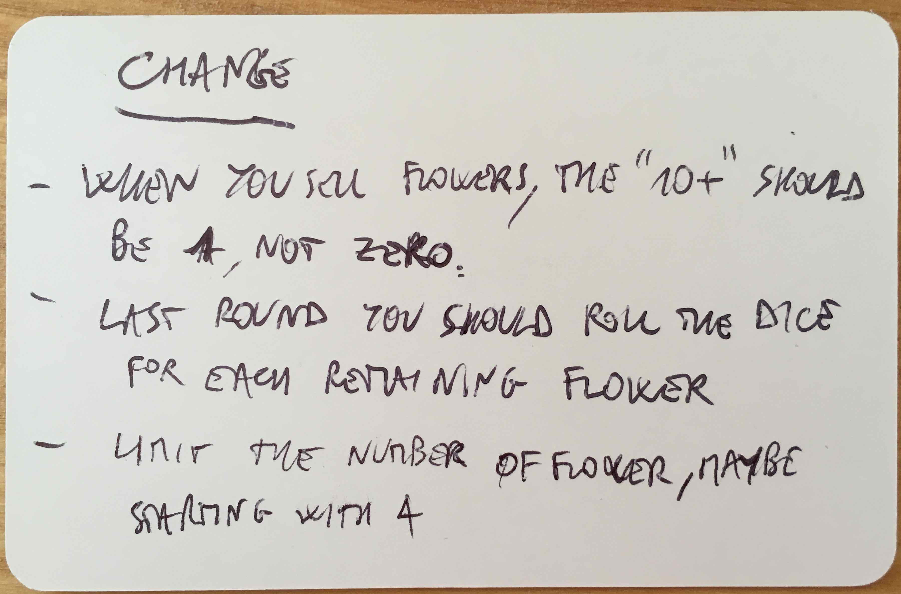
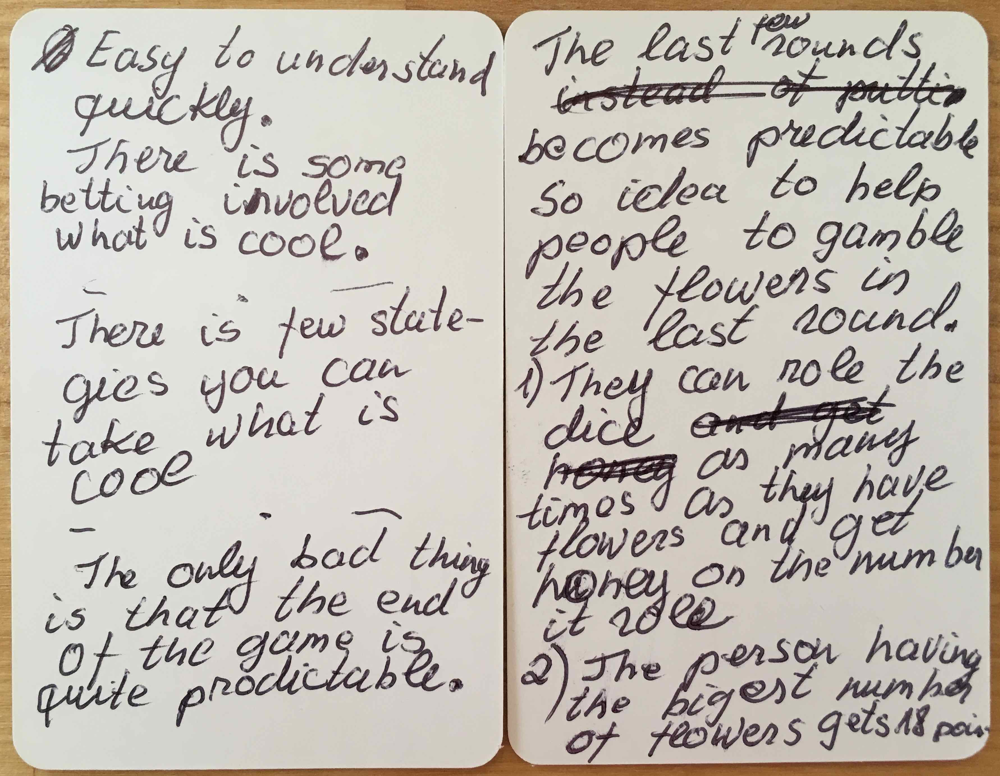
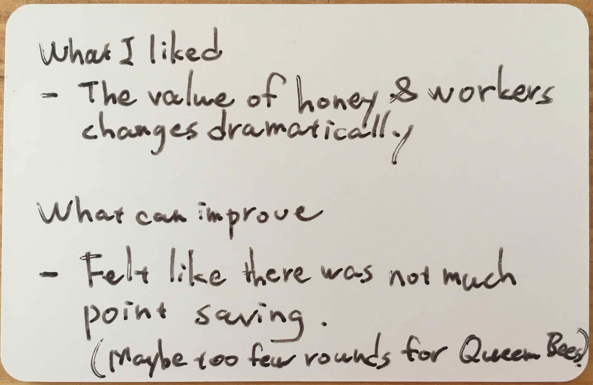
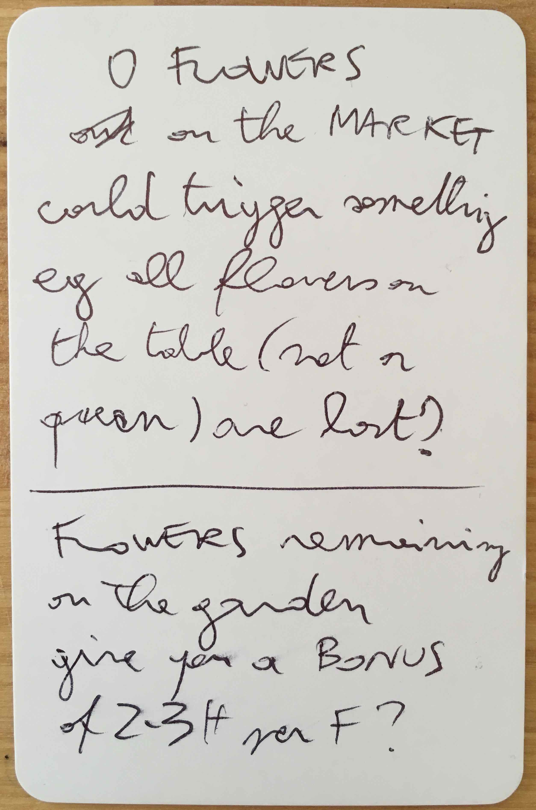
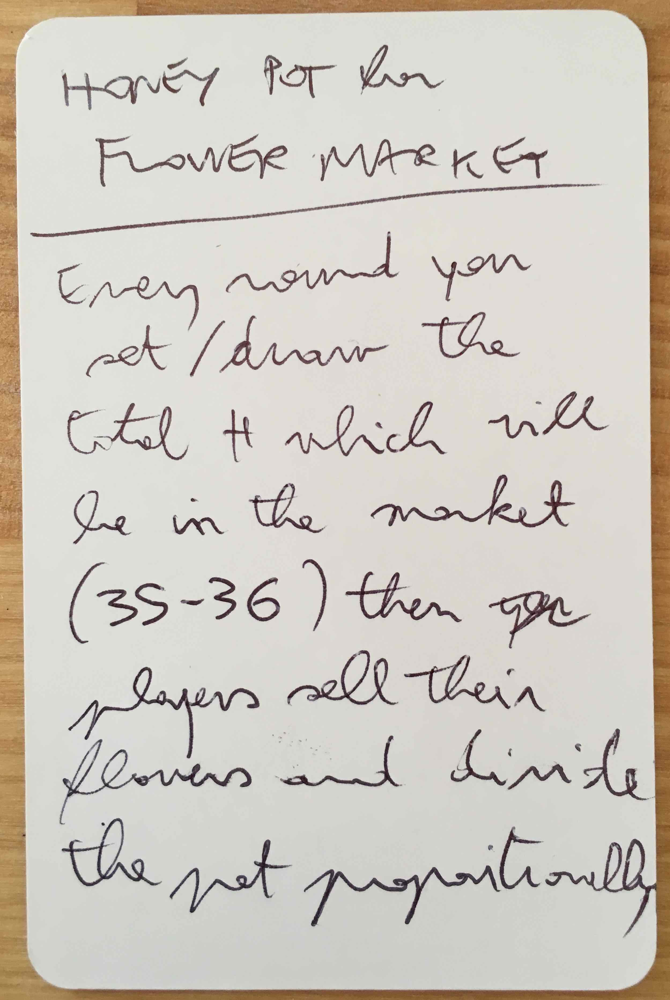

# The Hive v4.2 - 4p

Tested [v4.2](../versions/v4.2) with Matteo, Francesca, Viktorija and Yuki at The Hive.

[Listen to them playing](https://soundcloud.com/bpt20170609/matteo-francesca-viktorija-and-yuki-v42-the-hive?in=beesness/sets/playtesting) and [their feedback after](https://soundcloud.com/bpt20170609/matteo-francesca-viktorija-and-yuki-v42-feedback-the-hive?in=beesness/sets/playtesting).

Tweaks / experiments:

* Players can *trade* two or more bees for another bee with the bank, eg trade a worker (6H) for 2 drones (3H + 3H), 2 workers (6H + 6H) for a queen (12H).
* Bees are limited: 6D, **6W** and 6Q.
* Players start with 1W + 6H.
* Queen's cap is 12 honey.
* Referendum: each player gets a vote. If it's a tie, you count the number of bees (larger beesnesses win).
* New pricing chart
 
| Flowers | Price | 
|--|--|
| 1-3 | 12H |
| 4-5 | 9H |
| 6-7 | 6H |
| 8-9 | 3H |
| 10+ | 0 |

Final scores:

| | Matteo | Francesca | Viktorija | Yuki | 
|--|--|--|--|--|
| Honey | 15 | 29 | 42 | 36 |

## What went well

* **Limited bees** produce interesting game dynamics. First of all, players started to bid (aka **beed**) when two or more wanted to buy the same bee. Between rounds 7 and 8 Francesca bought a drone for a record 16H, rather than leaving it to Yuki. 

* In the first half of the game Yuki scooped up all the **drones** and kept them until the next-to-last round. This way, he `removed all the freelancers from the market` and prevented other players from attacking him.

* The game was **shorter** than in previous versions, with less time spent on individual turns and more on the flower + bees markets.

* With only **6 workers** (instead of the previous 12) there could be a market for them, whereas before there were more than players would need/want to buy.

* `Cheeseness` (new game with rats?!)

## Even better if

* **Referendum was never triggered**. Maybe there were not enough workers. With limited workers, replanting at the end of each round could be skipped.  

* What if **workers were also freelancers**?
 
* In the **last market** there were more than 10 flowers, so if everyone sold everything each flower would have gone for 0 honey (the `prisoners dilemma` said Matteo). We decided to make it 1 honey, but that means the final market will be rather dull and predictable, as everyone will inevitably sell all the flowers. Matteo and Viktorija suggested that the last market could involve the die in some way. I'm not sure this injection of luck would be good. Rather, the last market could be plaid out in 2 or 3 *instalments*.

* Flowers remaining in the garden could give you a **bonus**? Sounds like the environmental bonus that was rejected by previous playtesters.

* Flower market **honey pot**: instead of having a price chart, every market has a total number of honey available (for instance `36`, which would be easily divisible by most numbers). The price you get for a flower is a fraction of the honey pot, eg: 4 flowers, 9 honey each. This way **every flower counts**.

## Actions

- [ ] Solo-playtest **honey pot** for flower market.
- [ ] **Last market** in 2 or 3 *instalments*.
- [ ] **No replanting** at the end of each round. Start with 6 flowers and that's it.
- [ ] Solo-playtest: unilaterally decide to give back one bee for 2 flowers?
- [ ] Solo-playtest: freelance workers.
- [ ] Keep experimenting with **trading** bees, eg trade a worker for 2 drones, 2 workers for a queen etc.
- [ ] Keep experimenting with **bee scarcity**: 6D, 6W and 6Q (and solo-playtest these numbers for the 3P and 5P scenarios).
- [ ] **Referendum**: each player gets a vote. If it's a tie, you count the number of bees (larger beesnesses win).
- [ ] Reference cards: players can play their turn **actions in any order**.
- [ ] Reference cards: make it clear that players can **use all their cards** they have during their turn.
- [ ] Reference cards: remove reference to `selling` bees (it's trading). 
- [ ] **Timer**: 1 minute.
- [ ] Honey limit (12) should be on the Queen card.
- [ ] **Market prices**: 12, 9, 6, 3, 0?
- [ ] **Calendar** with turn & market phases.
- [ ] Encourage **trading and negotiating**.
- [ ] Solo-playtest: *Hive* card for savings. What about the Queen then?
- [ ] Solo-playtest: special bees (lazy, burn-out, defender, recruiter etc.)
- [ ] Solo-playtest: **round-based events**, eg *this round everyone loses a worker*, or *this round the queen is striking*